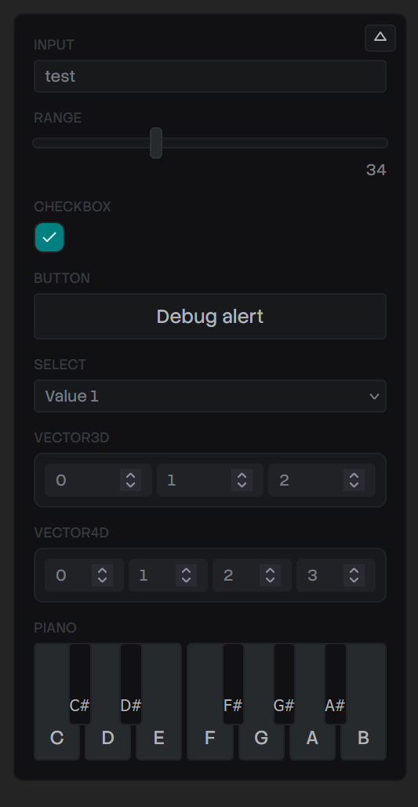

# Debug Panel

Simple debug panel for ReactJS apps. Lets you create inputs inside a debug panel and use their output in your app (like a debug text field, or color picker).

Perfect for prototyping and getting quick feedback, or presenting and allowing others to toggle aspects of the design.

## Supported Inputs

- String Input
- Number Input
- Range Slider
- Dropdown
- Checkbox / Switch
- Button
- Hotkeys
- Color Picker
- Vector (3D or 4D)
- Piano Keys

## How to use

1. Install: `npm i @whoisryosuke/debug-panel`
2. Use the hook `useDebug()` to create a debug input.

```tsx
const YourComponent = () => {
  const { yourInput } = useDebug({
    // String input
    yourInput: {
      type: "input",
      value: "test",
    },
  });

  return (
    <div>
      <p>{yourInput}</p>
    </div>
  );
};
```

The hook returns an object with the property/key name you provided (`yourInput` in this case).

3. Need a specific input? Use the `type` prop to change it.

```tsx
const { yourInput } = useDebug({
  // Range input
  range: {
    type: "range",
    min: 0,
    max: 100,
    step: 0.1,
    value: 4.2,
  },
});
```

> Check the [example app](./src/App.tsx) for previews of each type.

### Release

**Using GitHub:**

1. Run the new version GitHub action. _This updates your `package.json` with the new version and creates a new tag on GitHub._
1. Create a new release with the new version tag. _This triggers a build that automatically gets pushed to NPM._

**Or manually:**

1. Bump version in `package.json`
1. `yarn build`
1. `npm login`
1. `npm publish --access public`
1. Create new tag and release on GitHub.
